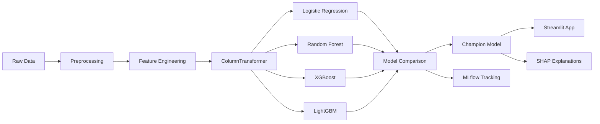

# Credit Card Approval Prediction

[](https://python.org)
[](LICENSE)
[](https://github.com/Tejas-952007/glm-5.1-testing-/actions)

End-to-end ML project that predicts whether a credit card application will be **Approved** or **Rejected**, with multi-model comparison, SHAP explanations, MLflow tracking, and a Streamlit dashboard.

---

## Architecture



---

## Features

| Feature | Details |
|---------|---------|
| **Multi-Model Training** | Logistic Regression, Random Forest, XGBoost, LightGBM with GridSearchCV |
| **Feature Engineering** | Income-to-Loan Ratio, Credit-per-Loan, Age-Credit Interaction, Has Existing Loans |
| **sklearn Pipeline** | ColumnTransformer prevents data leakage, OneHotEncoder for categoricals |
| **SHAP Explanations** | Beeswarm summary + per-prediction waterfall plots |
| **MLflow Tracking** | Full experiment logging — params, metrics, model artifacts |
| **Streamlit Dashboard** | Single prediction, batch CSV upload, model comparison, SHAP explanations |
| **Docker** | One-command deployment with `docker compose up` |
| **CI/CD** | GitHub Actions pipeline with automated testing |

---

## Project Structure

```
credit_card_approval/
├── data/
│   ├── generate_data.py          # Synthetic dataset generator
│   └── credit_data.csv           # Generated dataset
├── src/
│   ├── config.py                 # Centralized configuration
│   ├── logger.py                 # Logging setup
│   ├── preprocessing.py           # Pipeline: impute, engineer features, ColumnTransformer
│   ├── model.py                  # Multi-model training with GridSearchCV
│   ├── evaluate.py               # Metrics, confusion matrix, ROC, PR curves
│   ├── explain.py                # SHAP summary & waterfall
│   ├── track.py                  # MLflow experiment tracking
│   └── train.py                  # End-to-end training pipeline
├── app/
│   └── app.py                    # Streamlit multi-page dashboard
├── notebooks/
│   └── eda.ipynb                 # EDA notebook
├── tests/
│   ├── test_preprocessing.py
│   ├── test_model.py
│   └── test_evaluate.py
├── models/                       # Saved model & artifacts (gitignored)
├── plots/                        # Evaluation plots (gitignored)
├── .streamlit/config.toml        # Streamlit theme
├── .github/workflows/ci.yml      # GitHub Actions CI
├── Dockerfile
├── docker-compose.yml
├── requirements.txt
└── README.md
```

---

## Quick Start

### Option 1: Local Setup

```bash
# Clone the repo
git clone https://github.com/Tejas-952007/glm-5.1-testing-.git
cd credit_card_approval

# Create virtual environment
python -m venv venv
source venv/bin/activate        # Linux/macOS
# venv\Scripts\activate          # Windows

# Install dependencies
pip install -r requirements.txt

# Generate dataset & train models
python data/generate_data.py
python src/train.py

# Launch the Streamlit app
streamlit run app/app.py
```

### Option 2: Docker

```bash
docker compose up
# Open http://localhost:8501
```

---

## Usage

### Training Pipeline

```bash
python src/train.py
```

This will:
- Preprocess data (impute, engineer features, ColumnTransformer)
- Train all 4 models with GridSearchCV
- Compare models and select the champion by F1 score
- Generate evaluation plots in `plots/`
- Save the champion model to `models/model.joblib`
- Log experiments to MLflow (if installed)

### MLflow UI

```bash
mlflow ui --port 5000
# Open http://localhost:5000
```

### Run Tests

```bash
pytest tests/ -v
```

---

## Streamlit App Pages

| Page | Description |
|------|-------------|
| **Home** | Project overview, dataset stats, model comparison table |
| **Single Prediction** | Input form with probability gauge + SHAP waterfall explanation |
| **Batch Prediction** | Upload CSV, get predictions for all rows, download results |
| **Model Comparison** | Bar charts comparing F1/Precision/Recall/ROC-AUC across all models |

---

## Model Results

| Model | Accuracy | Precision | Recall | F1 | ROC AUC |
|-------|----------|-----------|--------|----|---------|
| *Champion selected by F1 score — see `models/comparison_results.csv`* |

*Run `python src/train.py` to generate latest results.*

---

## Screenshots

<!-- Add screenshots after running the app -->

*Single Prediction with SHAP explanation:*


*Batch Prediction:*


*Model Comparison:*


---

## Tech Stack

- **Python 3.11**
- **scikit-learn** — Pipeline, ColumnTransformer, GridSearchCV
- **XGBoost / LightGBM** — Gradient boosting classifiers
- **SHAP** — Model interpretability
- **MLflow** — Experiment tracking
- **Streamlit** — Interactive dashboard
- **Docker** — Containerized deployment
- **GitHub Actions** — Automated CI

## License

MIT